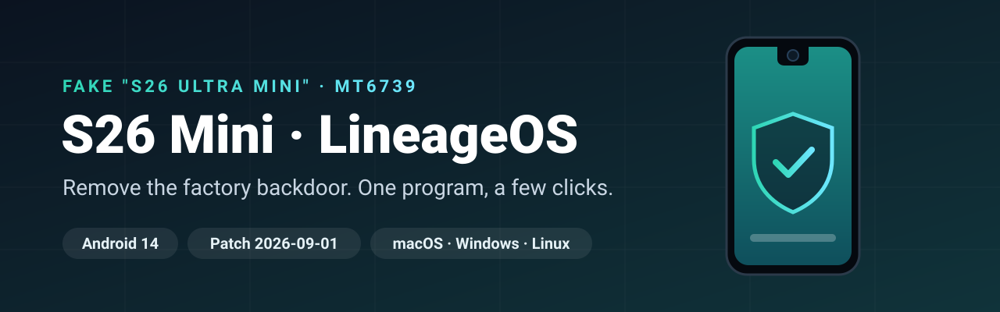

  

  
  
  
  
   
  
  
  
  
  

  🇧🇷 <a href="README.pt-BR.md"><b>Leia em português</b></a> · 📖 <a href="https://github.com/oauramos/s26mini-lineageos/wiki"><b>Wiki</b></a>

---

The cheap **"Samsung S26 ULTRA Mini"** sold across Brazil isn't a Samsung. Its factory firmware ships with a **hidden code loader that can inject code into every app**, tools that **rewrite the IMEI**, and a **faked security patch** ([analysis](https://github.com/oauramos/s26mini-lineageos/wiki/Stock-Firmware-Analysis)).

**This installer replaces the whole system with a clean LineageOS 21** (Android 14, September 2026 patches). You plug the phone in, answer three questions and wait.

## Install in 3 steps

**1. Download the installer**

| macOS (Intel + Apple Silicon) | Windows | Linux |
|:---:|:---:|:---:|
| [**s26mini-installer-macos.zip**](https://github.com/oauramos/s26mini-lineageos/releases/latest/download/s26mini-installer-macos.zip) | [**s26mini-installer-windows.exe**](https://github.com/oauramos/s26mini-lineageos/releases/latest/download/s26mini-installer-windows.exe) | [**x86_64**](https://github.com/oauramos/s26mini-lineageos/releases/latest/download/s26mini-installer-linux-amd64.tar.gz) · [**arm64**](https://github.com/oauramos/s26mini-lineageos/releases/latest/download/s26mini-installer-linux-arm64.tar.gz) |

**2. On the phone**, turn on developer mode: Settings → About phone → tap **Build number** 7×. Then Settings → System → Developer options → turn on **OEM unlocking** and **USB debugging**.

**3. Plug the phone in with a USB-A → USB-C cable and run the installer.** It downloads everything, checks every file's SHA-256, and tells you when to tap something on the phone.

> [!IMPORTANT]
> **USB-C ↔ USB-C cables don't work** with this phone. Use USB-A → USB-C (an adapter on the computer side is fine).

> [!NOTE]
> **"Unidentified developer"?** The installer isn't signed with a paid certificate yet.
> **macOS:** right-click the file → **Open** → **Open** (or System Settings → Privacy & Security → **Open Anyway**).
> **Windows:** **More info** → **Run anyway**.
> **Linux:** `tar xzf s26mini-installer-linux-*.tar.gz && ./s26mini-installer`

## You choose

| | Without Google *(recommended)* | With Google Play |
|---|:---:|:---:|
| Play Store and Google services | – | ✅ |
| Privacy, free RAM | ✅ best | good |
| **App bundle**: F-Droid, Termux, LocalSend, Files, Firefox, FTP server | ✅ default | optional |
| **Aurora Store** (Play Store apps, no Google account) | optional | – |

Every choice also gets the device fixes (Bluetooth, front-camera area) and an automatic **backup of your IMEI/calibration** to the computer.

> [!WARNING]
> **This erases everything on the phone.** Tested on board `d39g_4m_bml_s26ultra_mini_pt`; the installer checks it and warns you on anything else. At your own risk.
> Vendor, kernel and modem are still the manufacturer's: treat the phone as **semi-trusted** (no main Google account, no banking apps).
> This project does **not** change IMEIs. Doing so is a crime in Brazil.

## Want more?

Manual install with scripts, the Termux edition, hardware details, recovery from a brick: everything is in the **[wiki](https://github.com/oauramos/s26mini-lineageos/wiki)**.

[Installation Guide](https://github.com/oauramos/s26mini-lineageos/wiki/Installation-Guide) · [Editions and Apps](https://github.com/oauramos/s26mini-lineageos/wiki/Editions-and-Apps) · [Known Issues](https://github.com/oauramos/s26mini-lineageos/wiki/Device-Fixes-and-Known-Issues) · [Recovery](https://github.com/oauramos/s26mini-lineageos/wiki/Recovery-and-Backups) · [Security Model](https://github.com/oauramos/s26mini-lineageos/wiki/Security-Model) · [FAQ](https://github.com/oauramos/s26mini-lineageos/wiki/FAQ)

MIT licensed · Not affiliated with Samsung or LineageOS · Never post your IMEI, serial number or `nvram` dumps in issues.
