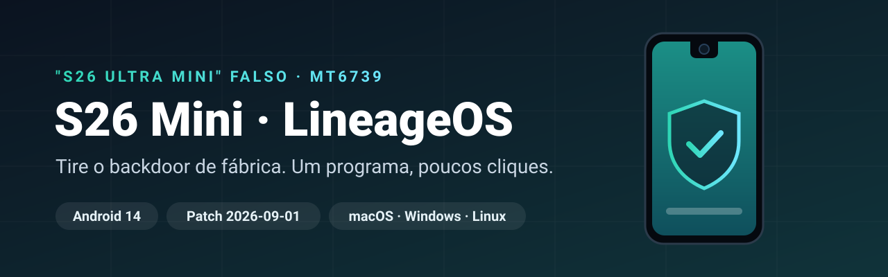

  

  
  
  
  
   
  
  
  
  
  

  🇺🇸 <a href="README.md"><b>Read in English</b></a> · 📖 <a href="https://github.com/oauramos/s26mini-lineageos/wiki"><b>Wiki</b></a>

---

O **"Samsung S26 ULTRA Mini"** barato, vendido no Brasil inteiro, não é Samsung. O sistema de fábrica vem com um **carregador de código escondido que pode injetar código em qualquer app**, ferramentas que **alteram o IMEI** e um **patch de segurança falso** ([análise](https://github.com/oauramos/s26mini-lineageos/wiki/Stock-Firmware-Analysis)).

**Este instalador troca o sistema inteiro por um LineageOS 21 limpo** (Android 14, patches de setembro de 2026). Você conecta o celular, responde três perguntas e espera.

## Instale em 3 passos

**1. Baixe o instalador**

| macOS (Intel + Apple Silicon) | Windows | Linux |
|:---:|:---:|:---:|
| [**s26mini-installer-macos.zip**](https://github.com/oauramos/s26mini-lineageos/releases/latest/download/s26mini-installer-macos.zip) | [**s26mini-installer-windows.exe**](https://github.com/oauramos/s26mini-lineageos/releases/latest/download/s26mini-installer-windows.exe) | [**x86_64**](https://github.com/oauramos/s26mini-lineageos/releases/latest/download/s26mini-installer-linux-amd64.tar.gz) · [**arm64**](https://github.com/oauramos/s26mini-lineageos/releases/latest/download/s26mini-installer-linux-arm64.tar.gz) |

**2. No celular**, ative o modo desenvolvedor: Configurações → Sobre o telefone → toque 7× em **Número da versão**. Depois, Configurações → Sistema → Opções do desenvolvedor → ative **Desbloqueio de OEM** e **Depuração USB**.

**3. Conecte o celular com um cabo USB-A → USB-C e abra o instalador.** Ele baixa tudo, confere o SHA-256 de cada arquivo e avisa quando você precisa tocar em algo no celular.

> [!IMPORTANT]
> **Cabo USB-C ↔ USB-C não funciona** neste celular. Use USB-A → USB-C (um adaptador no lado do computador serve).

> [!NOTE]
> **"Desenvolvedor não identificado"?** O instalador ainda não tem assinatura paga.
> **macOS:** clique com o botão direito no arquivo → **Abrir** → **Abrir** (ou Ajustes do Sistema → Privacidade e Segurança → **Abrir Mesmo Assim**).
> **Windows:** **Mais informações** → **Executar assim mesmo**.
> **Linux:** `tar xzf s26mini-installer-linux-*.tar.gz && ./s26mini-installer`

## Você escolhe

| | Sem Google *(recomendado)* | Com Google Play |
|---|:---:|:---:|
| Play Store e serviços do Google | – | ✅ |
| Privacidade, RAM livre | ✅ melhor | boa |
| **Pacote de apps**: F-Droid, Termux, LocalSend, Arquivos, Firefox, servidor FTP | ✅ padrão | opcional |
| **Aurora Store** (apps da Play Store sem conta Google) | opcional | – |

Todas as opções recebem os ajustes do aparelho (Bluetooth, área da câmera frontal) e um **backup automático do IMEI/calibração** no computador.

> [!WARNING]
> **Isso apaga tudo no celular.** Testado na placa `d39g_4m_bml_s26ultra_mini_pt`; o instalador confere e avisa se for outra. O risco é seu.
> Vendor, kernel e modem continuam sendo os de fábrica: trate o celular como **semi-confiável** (nada de conta Google principal nem app de banco).
> Este projeto **não** altera IMEI. Isso é crime no Brasil.

## Quer mais?

Instalação manual com scripts, versão Termux, detalhes do hardware, recuperação de brick: está tudo na **[wiki](https://github.com/oauramos/s26mini-lineageos/wiki)** (em inglês, com resumo em português).

[Guia de instalação](https://github.com/oauramos/s26mini-lineageos/wiki/Installation-Guide) · [Versões e apps](https://github.com/oauramos/s26mini-lineageos/wiki/Editions-and-Apps) · [Problemas conhecidos](https://github.com/oauramos/s26mini-lineageos/wiki/Device-Fixes-and-Known-Issues) · [Recuperação](https://github.com/oauramos/s26mini-lineageos/wiki/Recovery-and-Backups) · [Modelo de segurança](https://github.com/oauramos/s26mini-lineageos/wiki/Security-Model) · [FAQ](https://github.com/oauramos/s26mini-lineageos/wiki/FAQ)

Licença MIT · Sem vínculo com a Samsung ou o LineageOS · Nunca publique seu IMEI, número de série ou dumps de `nvram` nas issues.
